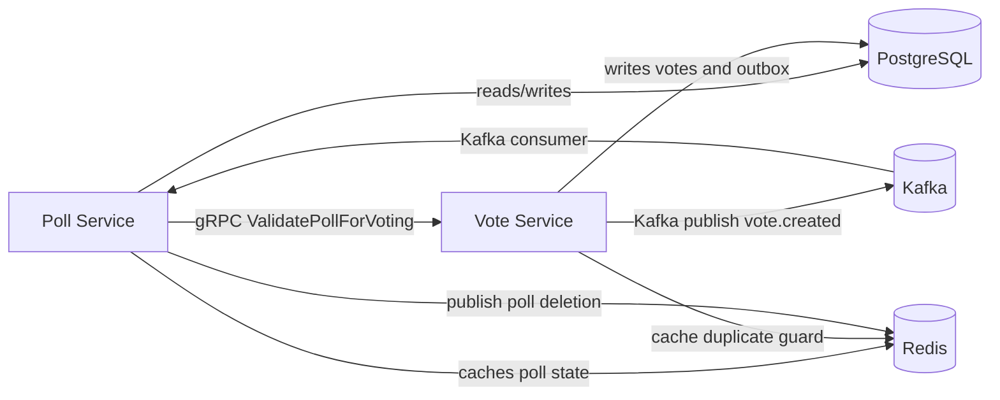

# Poll Maker

[](LICENSE) [](https://github.com/your-org/your-repo/actions) [](https://www.docker.com)

## Overview

Poll Maker is a production-ready microservices solution for creating polls, validating voting eligibility, and processing votes using a resilient event-driven architecture.

The project is composed of:

- `poll_service`: a NestJS service exposing REST endpoints and a gRPC contract for poll validation.
- `vote_service`: a Go/Fiber service handling vote creation, cache-based validation, and Kafka event publishing.
- shared infrastructure in Docker Compose: PostgreSQL, Redis, Kafka, Kafka UI, and RedisInsight.

## Architecture

The system is designed as a loosely coupled microservice ecosystem:

- `poll_service` stores poll metadata and options in PostgreSQL and caches active poll state in Redis.
- `vote_service` validates votes using a combination of cache and gRPC fallback, writes votes to PostgreSQL, and publishes vote events to Kafka.
- Kafka delivers `vote.created` events to `poll_service`, which updates vote counters and keeps poll state consistent.
- Redis pub/sub is used to invalidate vote cache after poll deletion.
- Database migration containers ensure schema changes are applied before services start.

## Workflow Architecture



## Key Features

- REST API for poll management and vote submission
- gRPC contract for poll validation across services
- Event-driven vote processing with Kafka
- Redis caching for poll metadata, vote deduplication, and performance
- Outbox-style event publishing from the vote service
- Graceful shutdown handling in Go service
- Validation with Zod in NestJS and `go-playground/validator` in Go
- End-to-end and unit testing support

## Technology Stack

- `poll_service`: NestJS, TypeScript, Drizzle ORM, Zod, Kafka, Redis, PostgreSQL, gRPC
- `vote_service`: Go 1.26, Fiber, pgx, Redis, Sarama Kafka client, gRPC client, SQL migrations
- Infrastructure: Docker Compose, Kafka, Redis, PostgreSQL

## Services

### poll_service

- REST endpoints:
  - `GET /api/v1/polls` � fetch public polls
  - `POST /api/v1/polls` � create a new poll
  - `DELETE /api/v1/polls/:id` � delete a poll
- gRPC service:
  - `PollService.ValidatePollForVoting`
- Kafka consumer:
  - `vote.created` event handler updates poll vote counts
- Redis cache layers:
  - poll metadata
  - vote option validation
  - deletion notification pub/sub

### vote_service

- REST endpoint:
  - `POST /api/v1/votes` � submit a vote
- Health check:
  - `GET /health`
- Vote flow:
  - Cache-based duplicate detection
  - Poll validity enforcement via Redis or gRPC fallback
  - Vote persistence in PostgreSQL
  - Asynchronous Kafka event publishing using an outbox pattern

## Local Development

### Prerequisites

- Docker and Docker Compose
- Node.js (for `poll_service`)
- pnpm
- Go 1.26

### Run the full stack

From the repository root:

```powershell
docker compose up --build
```

This starts:

- Postgres
- Redis
- Kafka + Kafka UI
- RedisInsight
- poll_service instances
- vote_service

### Build and run services manually

#### poll_service

```powershell
cd services/poll_service
pnpm install
pnpm run build
pnpm run start:prod
```

#### vote_service

```powershell
cd services/vote_service
go build -o bin/vote-service ./cmd
./bin/vote-service
```

### Environment configuration

- `services/poll_service/.env` contains local environment variables for the NestJS service.
- `services/vote_service/.env.example` documents the Go service variables.
- `compose.yaml` orchestrates the complete infrastructure and service startup sequence.

## Testing

### poll_service

```powershell
cd services/poll_service
pnpm run test
pnpm run test:e2e
pnpm run lint
```

### vote_service

```powershell
cd services/vote_service
go test ./...
```

## Production Readiness

This codebase is structured for production use with:

- multi-stage Docker builds
- non-root container runtime for Go and Node services
- schema migrations and service startup ordering
- resilient Kafka and Redis integration
- service-specific health checks
- structured logging and error handling

## Interview Highlights

- Clear separation of concerns: REST, gRPC, event processing, cache management, persistence
- Event-driven design with Kafka for eventual consistency and service decoupling
- Outbox-style event persistence in `vote_service` for reliable Kafka delivery
- Cache-first validation with fallback to inter-service gRPC to avoid stale data
- Strong testing strategy with unit and end-to-end coverage in both stacks
- Practical use of Docker Compose for local integration testing and deployment

## Notes

- `poll_service` uses `ClientsModule` and NestJS microservices to consume Kafka and expose gRPC.
- `vote_service` uses `Fiber` and Sarama to keep the vote path low-latency and robust.
- Redis is used for both fast validation and pub/sub invalidation to keep vote state consistent.

Feel free to explore `/services/poll_service` and `/services/vote_service` for the implementation details and service contracts.
